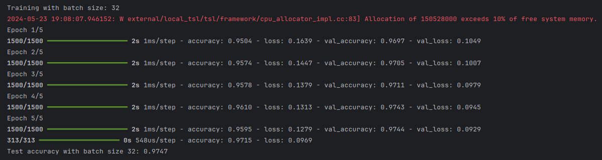
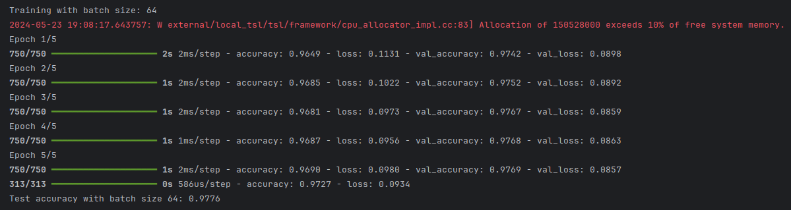
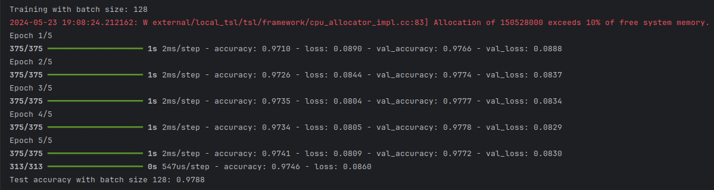
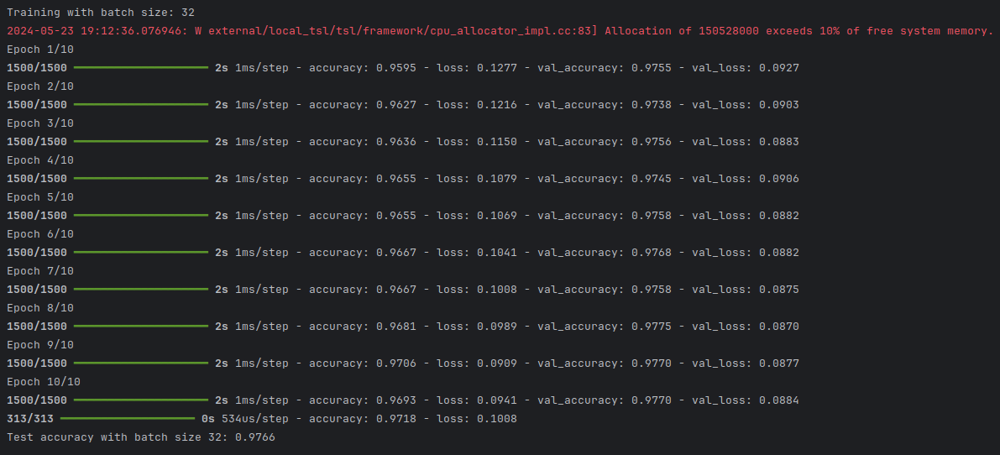
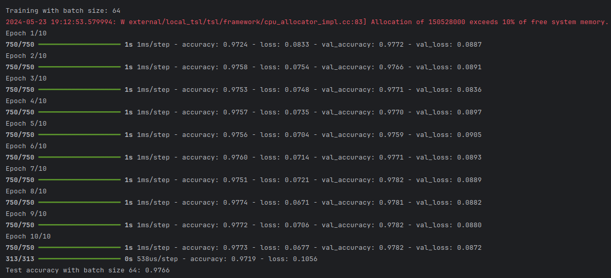
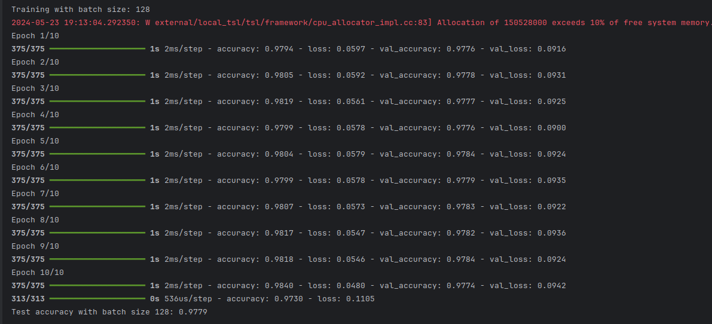
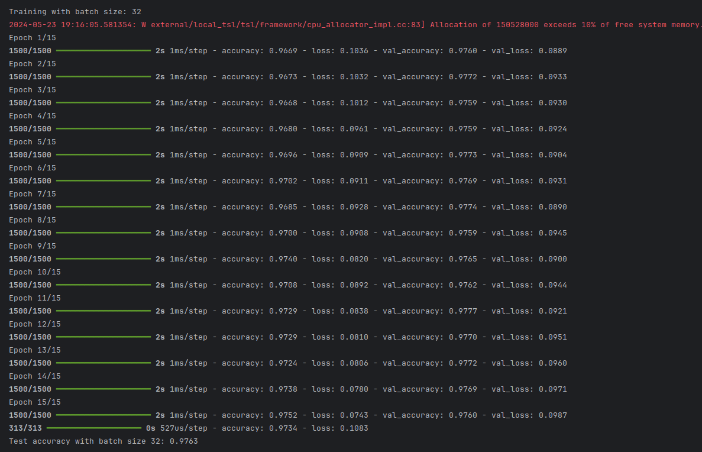
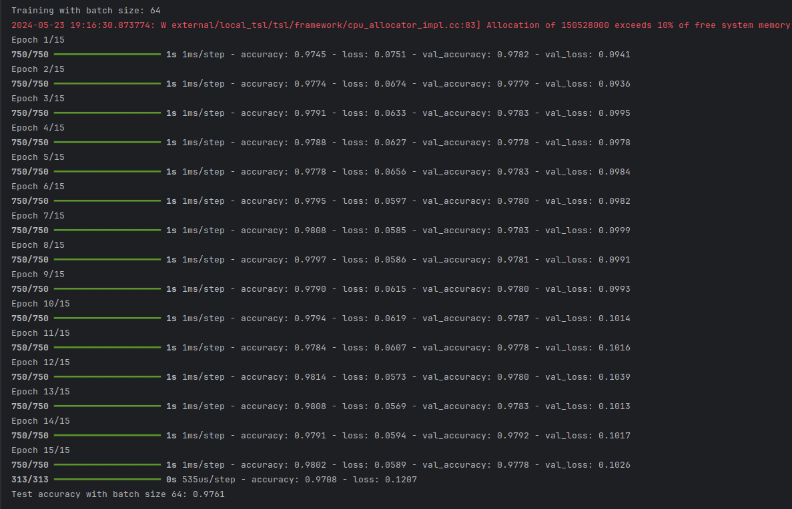
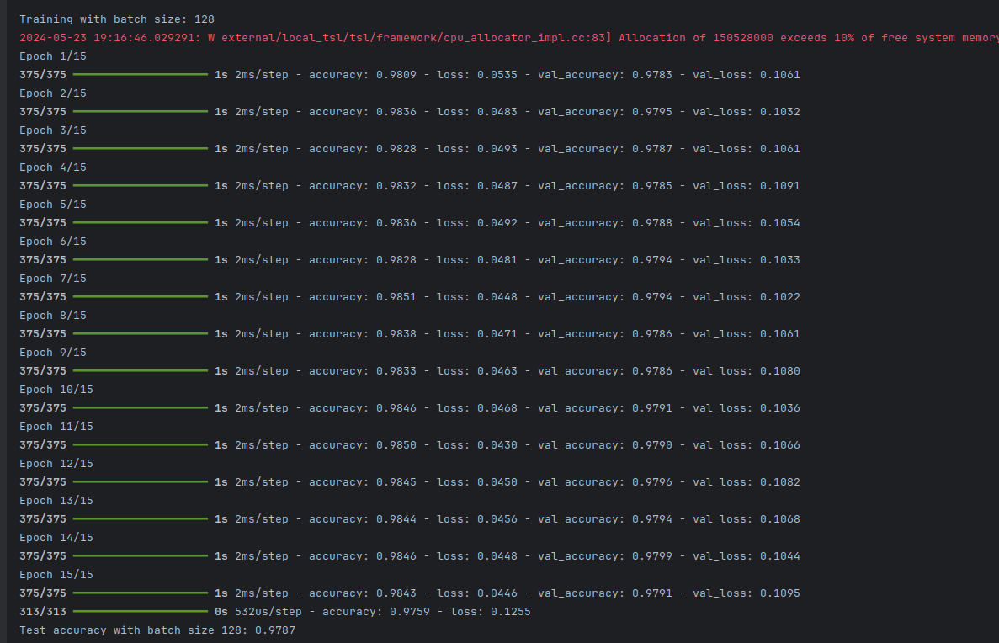

# Neural Network Classification with TensorFlow

### Project Description

In this project, we aim to build and evaluate a neural network (NN) model for classification tasks using TensorFlow,
focusing on utilizing the powerful and flexible Adam optimizer. We will use the MNIST dataset, a collection of grayscale
images of various hand writen items, as our dataset.

### Project Steps

1) **Data Selection and Preprocessing:**
    * We will use the MNIST dataset, which is publicly available and comes pre-processed and ready for use. The dataset
      consists of 60,000 training images and 10,000 test images, each of 28x28 pixels.
        * Each image will be normalized by scaling the pixel values to the range [0, 1] to facilitate better convergence
          during training.
          ```
             x_train, x_test = x_train / 255.0, x_test / 255.0
          ``` 
            * To validate normalization
                ```
                print(f"Max pixel value in training data: {x_train.max()}")
                print(f"Min pixel value in training data: {x_train.min()}")
                print(f"Max pixel value in test data: {x_test.max()}")
                print(f"Min pixel value in test data: {x_test.min()}")
              ```
              The Output Must be:
              ```
                  Max pixel value in training data: 1.0
                  Min pixel value in training data: 0.0
                  Max pixel value in test data: 1.0
                  Min pixel value in test data: 0.0
                ```

2) **Model Building:**
    * We will construct a feed-forward neural network using the Sequential API of TensorFlow/Keras.
    * The model will include the following layers:
        * A Flatten layer to transform the 2D input images into a 1D array.
        * A Dense hidden layer with 128 neurons and ReLU activation.
        * A Dropout layer with a dropout rate of 0.5 to prevent overfitting.
        * An output Dense layer with 10 neurons (one for each class) and softmax activation to produce a probability
          distribution over the classes.
3) **Model Compilation:**
    * The model will be compiled using the Adam optimizer, which combines the advantages of both AdaGrad and RMSProp
      optimization algorithms.
    * The loss function used will be sparse categorical cross-entropy, suitable for multi-class classification tasks.
    * We will monitor accuracy as our performance metric during training and evaluation.
4) **Model Training and Evaluation:**
    * The model will be trained on the training dataset with a validation split of 20% to monitor the model's
      performance on unseen data during training.
    * We will train the model for **5, 10, 15** epochs and track the training and validation accuracy and loss
    * After training, we will evaluate the model's performance on the test dataset using accuracy as the **primary
      metric**.
5) **Hyperparameter Tuning:**
    * We will explore different hyperparameter configurations, such as varying the batch size, to observe their impact
      on the model's performance.
    * We will retrain the model with different batch sizes (32, 64, 128) and compare the test accuracies to determine
      the optimal batch size.

## Project Deliverables

1) Code Implementation
    * The complete TensorFlow code for building, training, and evaluating the neural network model.
    * The code will include data preprocessing, model definition, training routines, evaluation metrics, and
      hyperparameter tuning.
2) Presentation
    * An introduction to the dataset and the problem being addressed.
    * A detailed explanation of the model architecture and the role of each layer.
    * Insights from the training process, including training and validation accuracy/loss graphs.
    * Evaluation metrics on the test dataset, with a focus on classification performance.
    * Results from hyperparameter tuning experiments.
    * Key takeaways and potential improvements for future work.

## Conclusion

By the end of this project, we will have developed a robust neural network model capable of classifying images of hand
writes digiits with high accuracy. We will demonstrate the practical application of TensorFlow for building and training
deep learning models and gain valuable insights into the effects of various hyperparameters on model performance.

# **Results:**

### Five Epoch

#### <span style="color:green;">32</span> Batch size


#### <span style="color:green;">64</span> Batch size


#### <span style="color:green;">128</span> Batch size



### Ten Epoch

#### <span style="color:green;">32</span> Batch size

#### <span style="color:green;">64</span> Batch size

#### <span style="color:green;">128</span> Batch size



### Five ten Epoch

#### <span style="color:green;">32</span> Batch size


#### <span style="color:green;">64</span> Batch size


#### <span style="color:green;">128</span> Batch size


